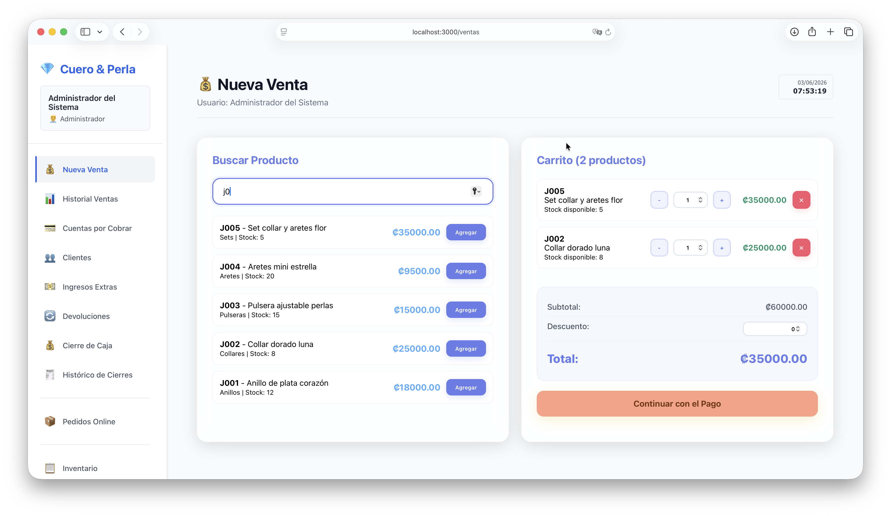
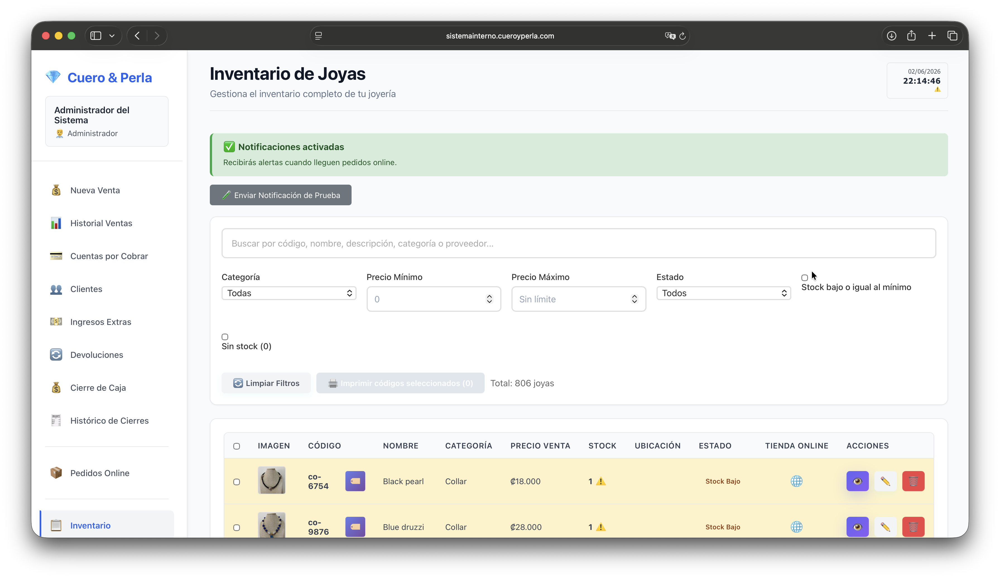
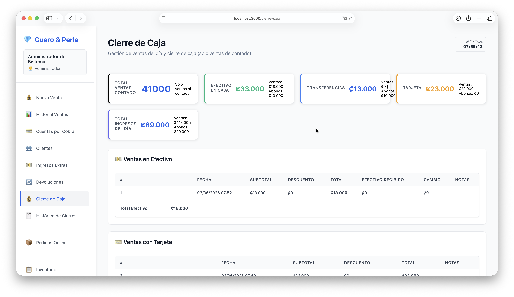
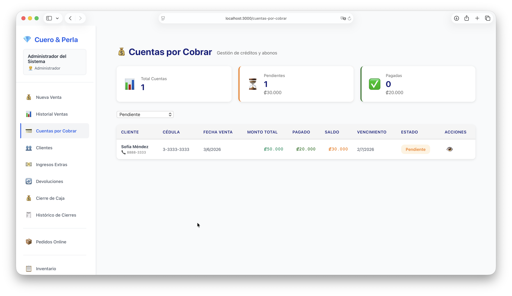
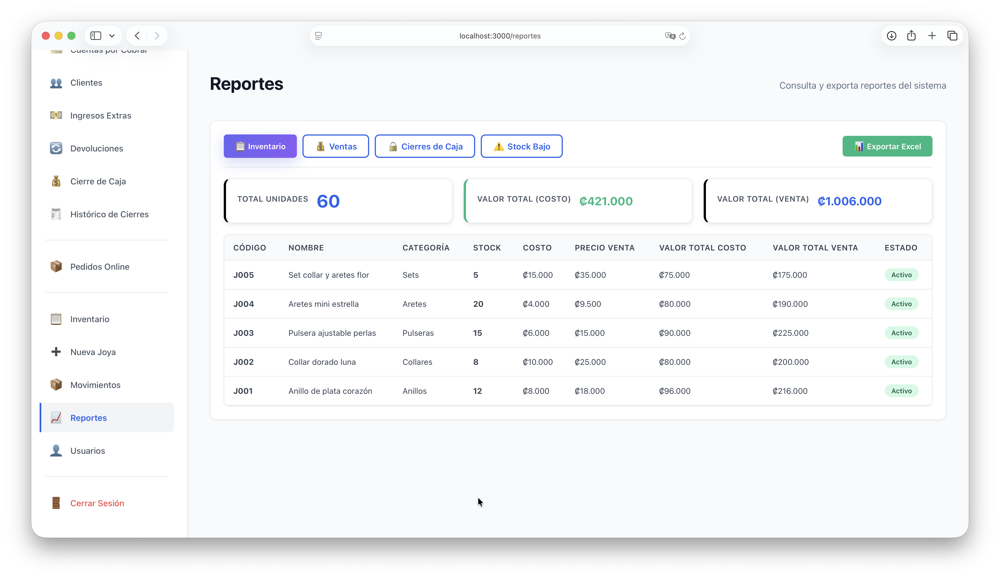
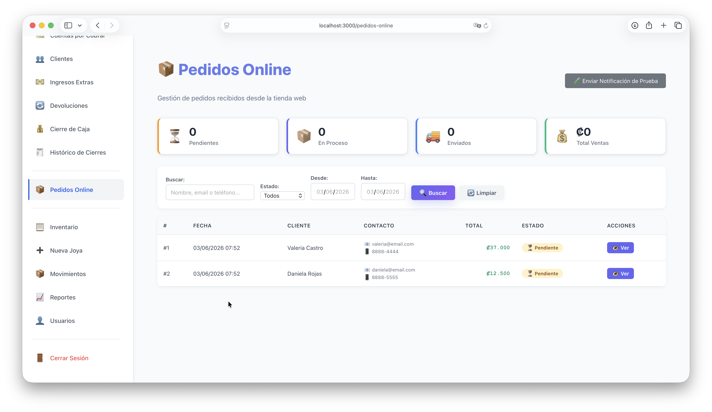
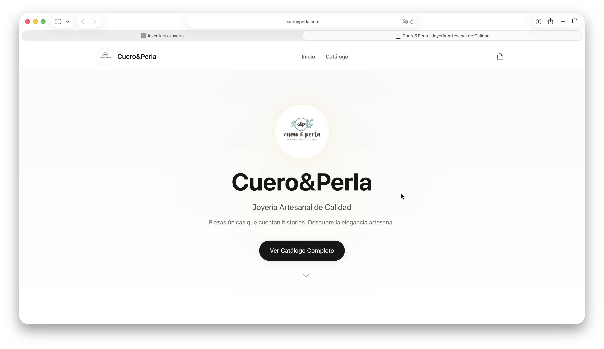
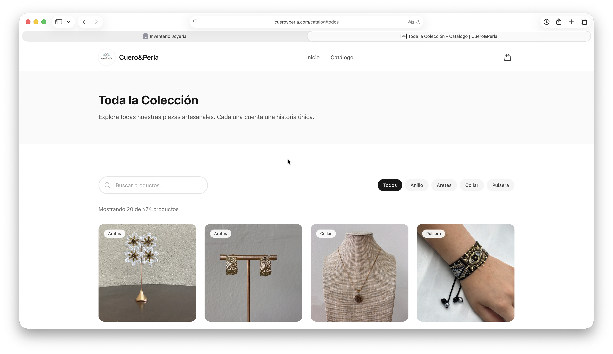
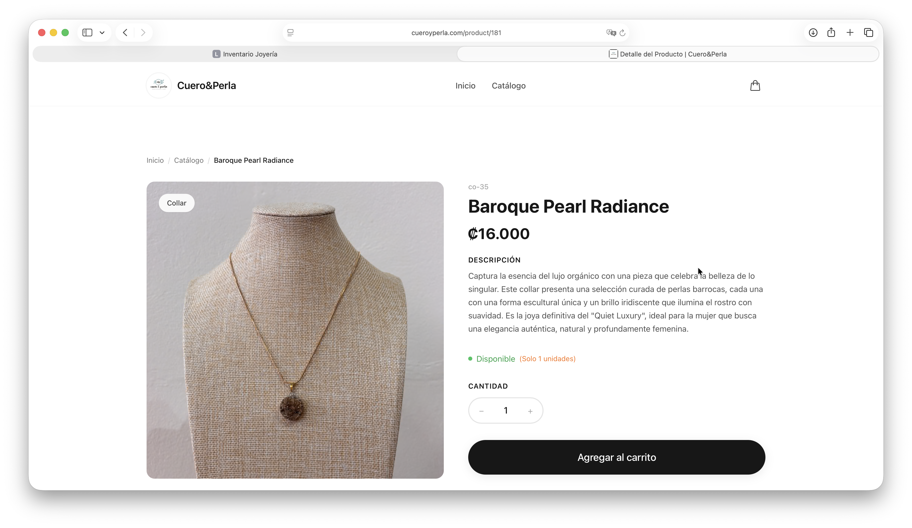
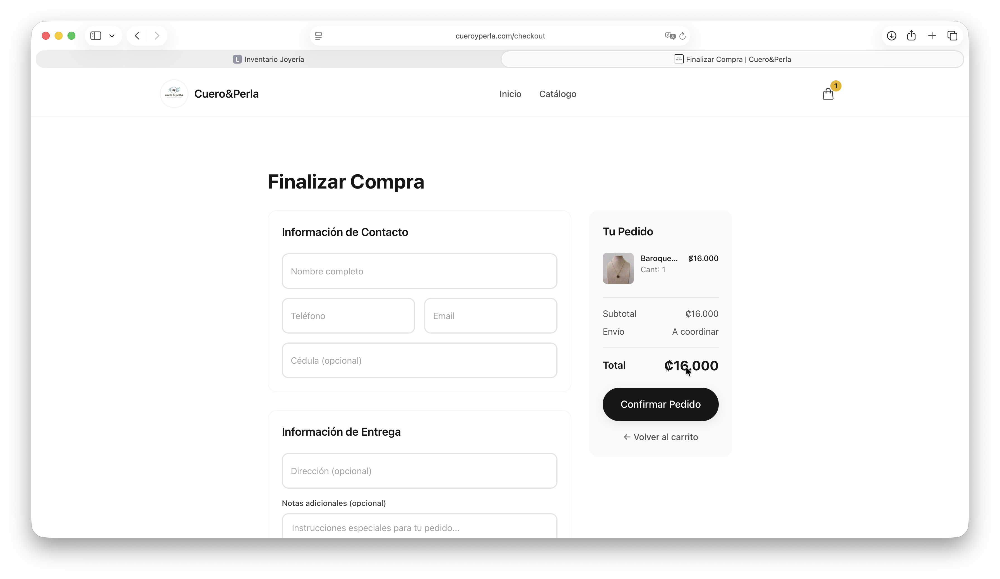

# Sistema Joyería

[](https://nodejs.org/)
[](https://react.dev/)
[](https://nextjs.org/)
[](https://supabase.com/)
[](LICENSE)

Plataforma de gestión integral para joyerías, construida como monorepo con tres aplicaciones independientes: una API REST, un sistema POS administrativo y una tienda online pública.

---

## Screenshots

### POS — Módulo de Ventas


### POS — Listado de Inventario


### POS — Cierre de Caja


### POS — Cuentas por Cobrar


### POS — Reportes


### POS — Pedidos Online (vista admin)


### Storefront — Página de Inicio


### Storefront — Catálogo


### Storefront — Detalle de Producto


### Storefront — Carrito y Checkout


---

## Descripción general

Sistema Joyería integra punto de venta, administración operativa y comercio electrónico en una arquitectura modular orientada a producción. Fue diseñado para la joyería artesanal **Cuero&Perla** (Costa Rica) y es adaptable a cualquier negocio de joyería o retail de productos similares.

```
Frontend POS (React) ────┐
                         ├──▶ Backend API (Express + Supabase) ──▶ PostgreSQL
Storefront (Next.js) ────┘                                    ──▶ Cloudinary
                                                              ──▶ Resend (email)
                                                              ──▶ Web Push
```

---

## Estructura del repositorio

```
sistemajoyeria/
├── backend/                  # API REST — Node.js + Express + Supabase
│   ├── models/               # Modelos de datos (Joya, Venta, Cliente, etc.)
│   ├── routes/               # Rutas organizadas por dominio
│   ├── middleware/           # Autenticación y control de roles
│   ├── services/             # Email (Resend), Push Notifications, Cloudinary
│   ├── utils/                # Timezone, validación de env, VAPID key gen
│   ├── tests/                # Pruebas unitarias, integración y rendimiento
│   ├── supabase-migration.sql
│   └── server.js
├── frontend/                 # POS administrativo — React 18
│   └── src/
│       ├── components/       # Módulos del sistema (Ventas, Inventario, etc.)
│       ├── services/         # Axios + detección automática de API URL
│       ├── context/          # AuthContext (sesión por cookie)
│       └── utils/            # Exportación Excel, formato de fechas
├── storefront/               # Tienda pública — Next.js 14 App Router
│   └── src/
│       ├── app/              # Páginas (home, catalog, product, cart, checkout, order)
│       ├── components/       # UI, layout, product, cart
│       ├── hooks/            # useCart, useApi
│       └── lib/              # API client, tipos TypeScript, config de tienda
├── scripts/                  # Orquestador de pruebas completas
├── nixpacks.toml             # Config de build para Railway
├── railway.json              # Config de despliegue Railway
├── package.json              # Workspaces npm (monorepo root)
└── Procfile
```

---

## Características

### Backend — API REST

- Autenticación con sesiones httpOnly (cookie-session), sin JWT
- Control de acceso por roles (`administrador` / `dependiente`)
- Gestión completa de inventario con variantes y productos compuestos (sets)
- Módulo de ventas: contado, crédito, mixto (efectivo + tarjeta + transferencia)
- Cuentas por cobrar con historial de abonos
- Devoluciones con reintegro de stock y registro de motivo
- Cierre de caja diario con resumen de movimientos e ingresos extras
- Pedidos online con integración de email transaccional (Resend)
- Notificaciones push en tiempo real (Web Push API + VAPID)
- Subida y gestión de imágenes con Cloudinary (múltiples imágenes por pieza)
- Generación de códigos de barras
- Reportes exportables: inventario, stock bajo, movimientos financieros, ventas por período
- Endpoints públicos para el storefront (catálogo sin autenticación)
- Validación de variables de entorno al arrancar con schema Zod
- Zona horaria configurable (por defecto `America/Costa_Rica`)

### Frontend POS — React 18

- Login protegido con redirección automática por sesión
- Punto de venta con búsqueda de productos en tiempo real
- Soporte de pago mixto (efectivo, tarjeta, transferencia y combinaciones)
- Impresión de ticket en impresora térmica 3nstar RPT008 vía WebUSB (ESC/POS) con fallback al navegador
- Gestión de inventario: CRUD de joyas con galería de imágenes, variantes y sets
- Historial de ventas con filtro por fecha y detalle por venta
- Gestión de clientes con historial de compras y cuentas por cobrar
- Devoluciones parciales o totales
- Cierre de caja con impresión de resumen
- Módulo de reportes con exportación a Excel (ExcelJS)
- Alertas de stock bajo
- Gestión de pedidos online recibidos desde el storefront
- Notificaciones push en el navegador
- Detección automática de URL del backend (localhost, IP local, producción)

### Storefront — Next.js 14

- Catálogo público con filtrado por categoría
- Página de detalle de producto con galería de imágenes con zoom
- Selector de variantes (diseños de la misma pieza)
- Vista de componentes para sets o productos compuestos
- Carrito lateral (drawer) con estado persistente en Zustand
- Flujo de checkout con formulario de datos de entrega
- Confirmación de pedido con resumen detallado
- Email de confirmación automático al cliente y al administrador
- SEO optimizado: Open Graph, sitemap, robots.txt
- Animaciones con Framer Motion
- Speed Insights de Vercel
- Soporte de moneda CRC (₡)

---

## Tech Stack

### Backend

- Node.js 20+
- Express 4
- Supabase (PostgreSQL)
- cookie-session (sesiones stateless)
- Cloudinary (imágenes)
- Resend (emails transaccionales)
- web-push (notificaciones push)
- bcryptjs
- Zod (validación de entorno)
- date-fns + date-fns-tz
- multer (carga de archivos)

### Frontend POS

- React 18
- React Router v6
- Axios
- ExcelJS (exportación Excel)
- react-to-print
- react-toastify
- @dnd-kit (drag and drop)
- WebUSB API (impresora térmica ESC/POS)

### Storefront

- Next.js 14 (App Router)
- TypeScript
- Tailwind CSS
- Zustand (estado del carrito)
- TanStack Query (React Query v5)
- Framer Motion
- Axios

### Infraestructura

- Railway (backend)
- Vercel (frontend POS + storefront)
- Supabase (base de datos en la nube)
- Cloudinary (CDN de imágenes)

---

## Roles del sistema

| Rol | Permisos |
|---|---|
| `administrador` | Acceso completo: inventario, ventas, reportes, cierre de caja, usuarios, devoluciones, pedidos online |
| `dependiente` | Ventas, consulta de inventario, clientes y cuentas por cobrar (sin acceso a reportes financieros ni administración de usuarios) |

---

## Modelos de datos (Supabase / PostgreSQL)

| Tabla | Descripción |
|---|---|
| `usuarios` | Cuentas del sistema con roles |
| `joyas` | Catálogo de productos con campos de e-commerce (slug, SEO, visibilidad en tienda) |
| `clientes` | Perfil de clientes |
| `ventas` | Ventas con soporte de múltiples métodos de pago |
| `items_venta` | Líneas de cada venta |
| `movimientos_inventario` | Trazabilidad de entradas y salidas |
| `cuentas_por_cobrar` | Saldos pendientes por cliente |
| `abonos` | Pagos parciales a cuentas |
| `movimientos_cuenta` | Historial detallado de cada cuenta |
| `ventas_dia` + `items_venta_dia` | Tabla temporal para el cierre de caja diario |
| `reservas_inventario` | Reserva de stock para pedidos online en proceso |
| `auditoria_inventario` | Trazabilidad completa para auditoría |
| `configuracion_tienda` | Parámetros globales del negocio |

---

## API — Endpoints principales

### Autenticación

```
POST   /api/auth/login
POST   /api/auth/logout
GET    /api/auth/session
GET    /api/auth/usuarios          (admin)
POST   /api/auth/usuarios          (admin)
PUT    /api/auth/usuarios/:id      (admin)
```

### Inventario

```
GET    /api/joyas
GET    /api/joyas/categorias
GET    /api/joyas/stock-bajo
GET    /api/joyas/verificar-codigo
GET    /api/joyas/:id
POST   /api/joyas
PUT    /api/joyas/:id
DELETE /api/joyas/:id
POST   /api/joyas/upload-image
GET    /api/variantes
POST   /api/variantes
GET    /api/productos-compuestos
POST   /api/productos-compuestos
```

### Ventas

```
POST   /api/ventas
GET    /api/ventas
GET    /api/ventas/:id
GET    /api/ventas/resumen/dia
GET    /api/ventas/resumen/periodo
POST   /api/ventas/:id/enviar-email
```

### Cierre de caja

```
GET    /api/cierrecaja/ventas-dia
GET    /api/cierrecaja/resumen-dia
POST   /api/cierrecaja/cerrar-caja
GET    /api/cierrecaja/historico
```

### Cuentas por cobrar y devoluciones

```
GET    /api/cuentas-por-cobrar
POST   /api/cuentas-por-cobrar
GET    /api/devoluciones
POST   /api/devoluciones
GET    /api/movimientos
```

### Pedidos online

```
POST   /api/public/orders           (sin auth — storefront)
GET    /api/public/orders/:id       (sin auth — storefront)
GET    /api/pedidos-online          (admin)
GET    /api/pedidos-online/:id      (admin)
PATCH  /api/pedidos-online/:id/estado
GET    /api/pedidos-online/resumen/stats
```

### Reportes

```
GET    /api/reportes/inventario
GET    /api/reportes/stock-bajo
GET    /api/reportes/ventas
GET    /api/reportes/movimientos-financieros
GET    /api/reportes/cierres-caja
GET    /api/reportes/historial-completo
```

### Catálogo público (storefront)

```
GET    /api/public/products
GET    /api/public/products/:id
GET    /api/public/categories
```

### Sistema y notificaciones

```
GET    /api/system/health
GET    /api/notifications
POST   /api/notifications/subscribe
POST   /api/notifications/send
```

---

## Requisitos

- Node.js 20+
- npm 9+
- Cuenta en [Supabase](https://supabase.com)
- Cuenta en [Cloudinary](https://cloudinary.com)
- Cuenta en [Resend](https://resend.com) (opcional, para emails)

---

## Instalación local

### 1. Clonar e instalar dependencias

```bash
git clone https://github.com/aleariasr/sistemajoyeria.git
cd sistemajoyeria
npm install
```

### 2. Configurar variables de entorno

```bash
cp backend/.env.example backend/.env
cp frontend/.env.example frontend/.env
cp storefront/.env.example storefront/.env.local
```

Editar cada archivo con los valores correspondientes (ver sección [Variables de entorno](#variables-de-entorno)).

### 3. Inicializar la base de datos

Ejecutar el script de migración en el SQL Editor de Supabase:

```
backend/supabase-migration.sql
```

Los usuarios iniciales se crean automáticamente al arrancar el backend por primera vez:

| Usuario | Contraseña | Rol |
|---|---|---|
| `admin` | `admin123` | administrador |
| `dependiente` | `dependiente123` | dependiente |

> **Importante:** Cambiar las contraseñas por defecto inmediatamente en producción.

---

## Ejecución en desarrollo

Abrir tres terminales:

```bash
# Terminal 1 — Backend (puerto 3001)
npm run dev:backend

# Terminal 2 — Frontend POS (puerto 3000)
npm run start:frontend

# Terminal 3 — Storefront (puerto 3002)
npm run dev:storefront
```

---

## Variables de entorno

### Backend (`backend/.env`)

```env
# Servidor
PORT=3001
HOST=0.0.0.0
NODE_ENV=development
TZ=America/Costa_Rica
SESSION_SECRET=your-secure-secret-key-change-in-production

# Producción (Railway + Vercel)
FRONTEND_URL=https://pos.vercel.app,https://tienda.vercel.app

# Supabase (requerido)
SUPABASE_URL=https://your-project.supabase.co
SUPABASE_KEY=your-supabase-anon-key

# Cloudinary (requerido para imágenes)
CLOUDINARY_CLOUD_NAME=your-cloud-name
CLOUDINARY_API_KEY=your-api-key
CLOUDINARY_API_SECRET=your-api-secret

# Resend (requerido para emails de pedidos)
RESEND_API_KEY=re_123456789
EMAIL_FROM=ventas@tutienda.com
EMAIL_FROM_NAME=Tu Tienda
EMAIL_REPLY_TO=contacto@tutienda.com
ADMIN_EMAIL=admin@tutienda.com
STORE_NAME=Tu Tienda
STORE_URL=https://tutienda.com
STORE_PHONE=+506-0000-0000

# Push Notifications (opcional)
# Generar con: node backend/utils/generateVapidKeys.js
VAPID_PUBLIC_KEY=
VAPID_PRIVATE_KEY=
VAPID_SUBJECT=mailto:admin@tutienda.com
```

### Frontend POS (`frontend/.env`)

```env
REACT_APP_API_URL=https://your-backend.railway.app/api
```

> En desarrollo local no es necesario: el frontend detecta la URL automáticamente según el hostname.

### Storefront (`storefront/.env.local`)

```env
NEXT_PUBLIC_API_URL=https://your-backend.railway.app/api
NEXT_PUBLIC_SITE_URL=https://your-storefront.vercel.app
```

---

## Pruebas

```bash
# Backend — todas las pruebas
npm run test:backend

# Backend — por módulo
npm run test:auth
npm run test:pos
npm run test:orders
npm run test:notifications
npm run test:backend:smoke
npm run test:backend:performance

# Frontend POS
npm run test:e2e:pos

# Storefront — unitarias
npm run test:storefront

# Storefront — E2E con Playwright
npm run test:storefront:e2e

# Suite completa (orquestador)
npm run test:full
```

---

## Despliegue en producción

### Backend → Railway

El repositorio incluye `railway.json` y `nixpacks.toml` preconfigurados.

Variables mínimas requeridas en Railway:

```env
NODE_ENV=production
SESSION_SECRET=<valor-largo-y-aleatorio>
FRONTEND_URL=https://<pos>.vercel.app,https://<storefront>.vercel.app
SUPABASE_URL=<url>
SUPABASE_KEY=<key>
CLOUDINARY_CLOUD_NAME=<name>
CLOUDINARY_API_KEY=<key>
CLOUDINARY_API_SECRET=<secret>
```

Generar `SESSION_SECRET`:

```bash
node -e "console.log(require('crypto').randomBytes(32).toString('hex'))"
```

### Frontend POS → Vercel

- Root directory: `frontend`
- Build command: `npm run build`
- Output directory: `build`
- Variable de entorno: `REACT_APP_API_URL=https://<backend>.railway.app/api`

### Storefront → Vercel

- Root directory: `storefront`
- Build command: `npm run build`
- Output directory: `.next`
- Variables de entorno:
  - `NEXT_PUBLIC_API_URL=https://<backend>.railway.app/api`
  - `NEXT_PUBLIC_SITE_URL=https://<storefront>.vercel.app`

### Verificación post-deploy

```
GET /api/system/health   →  debe responder 200 OK
```

1. Hacer login en el POS y crear una venta de prueba.
2. Verificar que el catálogo carga en el storefront.
3. Confirmar que el CORS entre frontends y backend está funcionando.

---

## Seguridad

- Variables sensibles fuera del repositorio (`.env` no versionado)
- Sesiones con cookies `httpOnly`, `secure: true` y `sameSite: 'none'` en producción
- Contraseñas hasheadas con bcryptjs
- CORS restringido a los dominios configurados en `FRONTEND_URL`
- Validación de esquema de entorno al iniciar con Zod (el servidor no arranca si faltan variables críticas)
- Consultas a Supabase parametrizadas (sin concatenación directa de SQL)
- Headers de seguridad: HSTS, X-Frame-Options
- Control de acceso por rol en cada endpoint protegido

Para reportar vulnerabilidades, usar Security Advisories de GitHub o contactar directamente a los mantenedores del repositorio.

---

## Comandos de referencia rápida

```bash
# Instalar todo
npm install

# Desarrollo
npm run dev:backend          # Backend con nodemon (puerto 3001)
npm run start:frontend       # POS React (puerto 3000)
npm run dev:storefront       # Storefront Next.js (puerto 3002)

# Build
npm run build:frontend
npm run build:storefront

# Pruebas
npm run test:backend
npm run test:full

# Auditoría de dependencias
npm run audit:backend
npm run audit:frontend
npm run audit:storefront
```

---

## Autor

Alejandro Arias Rojas

Software Developer  
Informática Empresarial  
Universidad de Costa Rica
